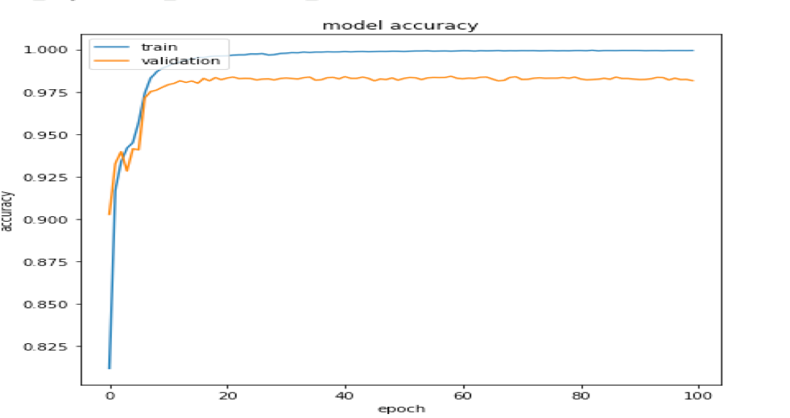
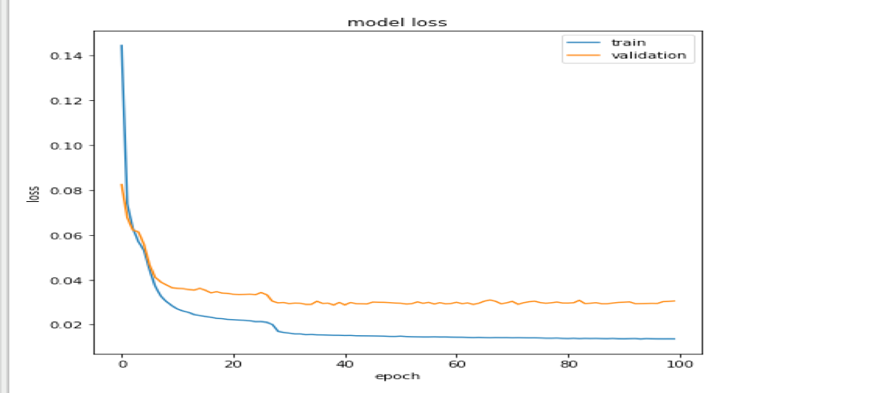

<<<<<<< HEAD
=======

>>>>>>> f12cd29308a1510d778d1a37c6f04bdc100e1c3e
# Siamese_Network

## Introduction
Despite impressive results in object classification, verification and recognition, most deep neural network based recognition systems become brittle when the view point of the camera changes dramatically. Robustness to geometric transformations is highly desirable for applications like wild life monitoring where there is no control on the pose of the objects of interest. The images of different objects viewed from various observation points define equivalence classes where by definition two images are said to be equivalent if they are views from the same object.
These equivalence classes can be learned via embeddings that map the input images to high dimensional vectors. During training, equivalent images are mapped to vectors that get pulled closer together, whereas if the images are not equivalent their associated vectors get pulled apart.

The propse of this project is to implement a deep neural network classifer to predict whether two handwritten images belong to the same class.The handwritten images are from the Keras’s digital image dataset – MNIST. The network used in this project is Siamese network The Siamese network has two identical subnetworks that shared the same weights followed by a distance calculation layer. 


## Dataset

import dataset from keras
```
keras.datasets.mnist.load_data()

``` 

* The network classifer will only learn the classification from digtis in [2,3,4,5,6,7]
* The digits in [0,1,8,9] are only used for testing. None of these digits should be used during training.

## Evaluation

* testing it with pairs from the set of digits [2,3,4,5,6,7]
* testing it with pairs from the set of digits [2,3,4,5,6,7] union [0,1,8,9] 
* testing it with pairs from the set of digits [0,1,8,9]

## Result 

Figure below indicates the model accuracy on training data and validation data. As can be seen from the figure, the model accuracy on training set increases significantly in the first few epochs, after around 15 epochs, model accuracy increases slightly and reaching 99.993%. The model accuracy on the validation set increased significantly in the first few epochs, after that it starts floating and did not improve much. After 100 epochs, the accuracy on the validation set is 0.9816%. Therefor checkpoint function here will save the model with the best accuracy on the validation set and drop the later model trained with 100 epochs.



Figure below indicates model loss on training data and validation data. As can be seen from the figure, the model loss on training set decreases significantly in first 20 epochs, after that model loss decreases slightly and reach 0.0136. The model loss on validation set decreases significantly in the first 20 epochs. After that, it starts floating and ends with 0.0306 after 100 epochs



Model accuracy on training set and validation

| Group         | Accuracy          |
| ------------- |:-------------:| 
| Training set  | 99.96%        |
| Testing set [2,3,4,5,6,7]    | 98.15%     |
| Testing set [0,1,8,9] | 70.19%     |
| Testing set [0,1,8,9] union [2,3,4,5,6,7]  | 83.67%       |
<<<<<<< HEAD
=======

>>>>>>> f12cd29308a1510d778d1a37c6f04bdc100e1c3e
